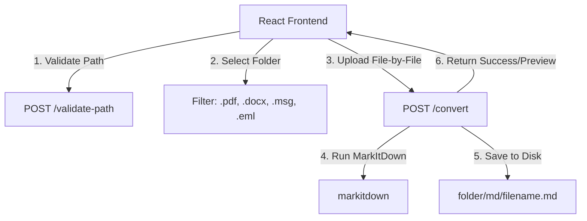

# Design Spec: Local Folder to Markdown Converter

## Overview
A web-based local utility that allows users to select a local folder in their browser, enter its absolute path, and convert all supported documents (`.pdf`, `.docx`, `.msg`, `.eml`) to Markdown. The application uses Microsoft's `markitdown` library on a Python FastAPI backend and displays real-time progress on a React frontend.

---

## 1. System Architecture



---

## 2. Backend Design (FastAPI)

The backend will run locally, default port `8000`.

### 2.1 Endpoints

#### `POST /validate-path`
Validates that the path submitted by the frontend represents a valid, writeable directory on the local machine.
*   **Request**: `multipart/form-data` with field `path` (string).
*   **Response**:
    ```json
    {
      "valid": true,
      "error": null
    }
    ```
    or
    ```json
    {
      "valid": false,
      "error": "Directory does not exist or is not writable."
    }
    ```

#### `POST /convert`
Processes a single document upload and saves its markdown conversion locally.
*   **Request**: `multipart/form-data` with fields:
    *   `file`: `UploadFile` (binary file contents)
    *   `output_dir`: string (absolute path to the source folder)
*   **Response (Success)**:
    ```json
    {
      "filename": "guide.pdf",
      "saved_path": "/absolute/path/to/folder/md/guide.md",
      "markdown": "# Converted Title\n...",
      "status": "success",
      "error": null
    }
    ```
*   **Response (Failure)**:
    ```json
    {
      "filename": "guide.pdf",
      "saved_path": null,
      "markdown": null,
      "status": "error",
      "error": "Failed to parse PDF: file corrupted"
    }
    ```

### 2.2 File Saving & Collision Prevention
*   For each request, the backend creates the directory `folder/md/` if it does not exist.
*   The backend extracts the base filename (excluding extension), e.g., `guide.pdf` -> `guide`.
*   It checks if `folder/md/guide.md` exists.
*   If it exists, it loops incrementing a counter until a unique filename is found: `guide_1.md`, `guide_2.md`, etc.
*   It saves the full Markdown output to that path.

---

## 3. Frontend Design (React + Vite)

The frontend will run locally, default port `5173`.

### 3.1 Components
*   **Main Dashboard**: Layout wrapper with a dark mode glassmorphic UI.
*   **Configuration Panel**:
    *   Text input for directory path (e.g. `/Users/fred/Documents/my_folder`). Calls `/validate-path` with debounce.
    *   Folder input with `webkitdirectory="true" directory="true" multiple` styled as an interactive dropzone.
*   **Conversion Queue**:
    *   Shows overall conversion progress (progress bar, counter: `X / Y completed`).
    *   Shows a list of files with their states: `Pending`, `Processing` (spinner), `Success` (checkmark), or `Error` (cross).
    *   `Start Conversion` and `Cancel` controls.
*   **File Preview Drawer**:
    *   Slide-over panel or side panel showing the details of the clicked file in the queue.
    *   Contains "Copy Markdown", "Open Location", and a scrollable markdown code-block preview.

### 3.2 State Machine
*   `filesQueue`: Array of `{ file: File, status: 'pending'|'processing'|'success'|'error', errorMsg: string, markdown: string, savedPath: string }`
*   `isProcessing`: Boolean
*   `targetPath`: String (the path entered by the user)
*   `isPathValid`: Boolean

---

## 4. Verification Plan

### 4.1 Automated Tests
*   Unit tests in FastAPI using `pytest` to verify conversion route and name collision prevention.

### 4.2 Manual Verification
1. Open the UI, type an invalid path -> check that error warning appears.
2. Type a valid path -> check that path is validated successfully.
3. Select a folder with 5 test documents (e.g., 2 PDFs, 1 DOCX, 1 EML, 1 MSG).
4. Run conversion -> verify progress bar fills up.
5. Click on completed items -> verify Markdown contents are displayed in the preview drawer.
6. Verify that an `md/` subdirectory is created inside the target folder containing the converted `.md` files.
7. Re-convert the folder -> verify that duplicate files are created with incrementing suffixes (`_1.md`, `_2.md`).
